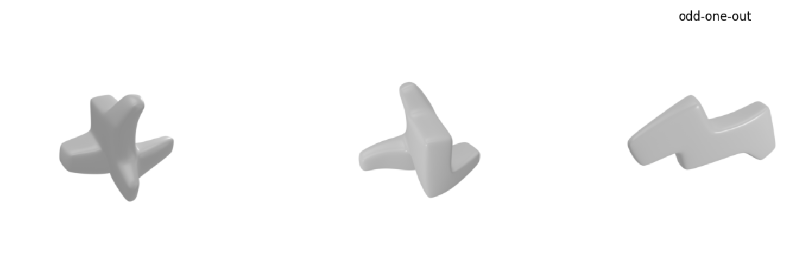

## MOCHI: Multiview Object Consistency in Humans and Image models

We introduce **MOCHI** (Multiview Obect Consistency in Humans and Image models), a benchmark to evaluate the alignment between humans and image models on 3D shape understanding. 

To download dataset from huggingface, install relevant huggingface libraries
```
pip install datasets huggingface_hub
```

and download MOCHI 

```python

from datasets import load_dataset

# download huggingface dataset 
benchmark = load_dataset("tzler/MOCHI")['train']

# there are 2019 trials let's pick one 
i_trial = benchmark[1879]

```

Here, `i_trial` is a dictionary with trial-related data including human (`human` and `RT`) and model (`DINOv2G`) performance measures: 

```
{'dataset': 'shapegen',
 'condition': 'abstract2',
 'trial': 'shapegen2527',
 'n_objects': 3,
 'oddity_index': 2,
 'images': [<PIL.PngImagePlugin.PngImageFile image mode=RGB size=1000x1000>,
  <PIL.PngImagePlugin.PngImageFile image mode=RGB size=1000x1000>,
  <PIL.PngImagePlugin.PngImageFile image mode=RGB size=1000x1000>],
 'n_subjects': 15,
 'human_avg': 1.0,
 'human_sem': 0.0,
 'human_std': 0.0,
 'RT_avg': 4324.733333333334,
 'RT_sem': 544.4202024405384,
 'RT_std': 2108.530377391076,
 'DINOv2G_avg': 1.0,
 'DINOv2G_std': 0.0,
 'DINOv2G_sem': 0.0}```

```

as well as this trial's images: 

```python
plt.figure(figsize=[15,4])
for i_plot in range(len(i_trial['images'])):
  plt.subplot(1,len(i_trial['images']),i_plot+1)
  plt.imshow(i_trial['images'][i_plot])
  if i_plot == i_trial['oddity_index']: plt.title('odd-one-out')
  plt.axis('off')
plt.show()
```
