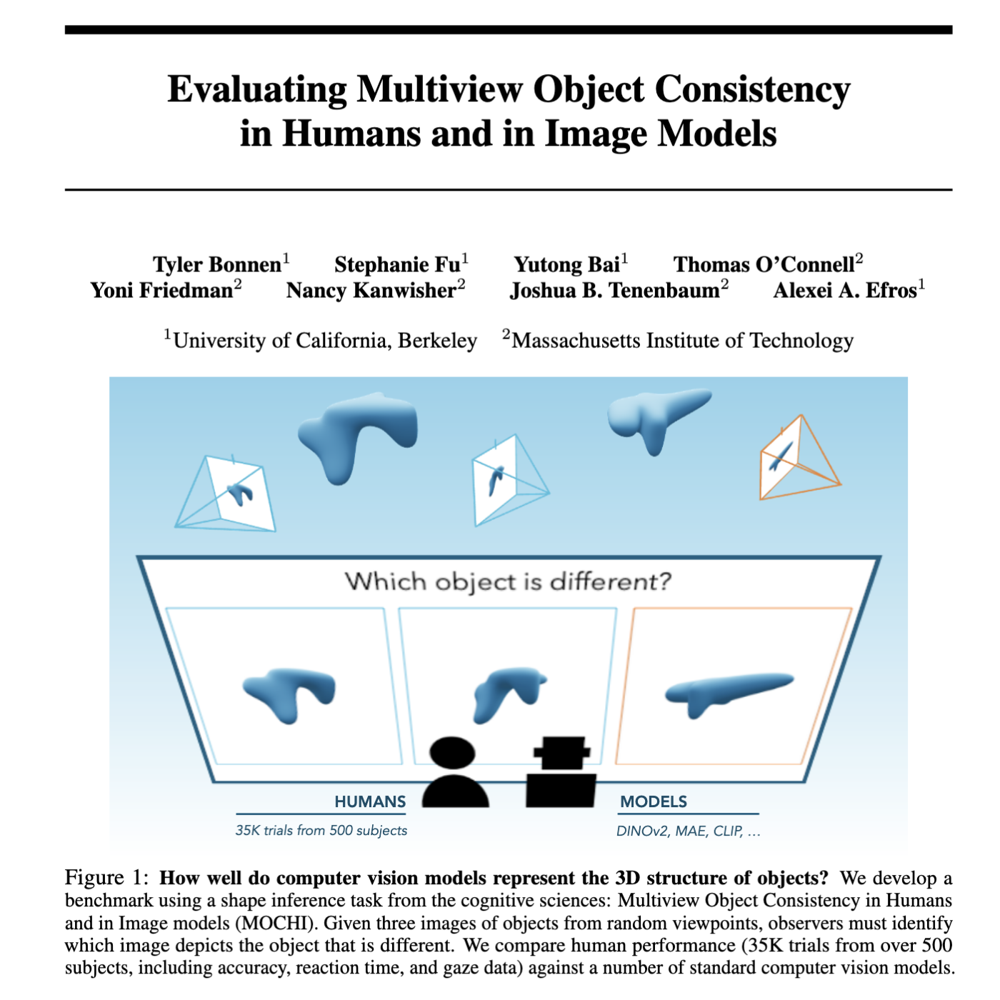

## MOCHI: Multiview Object Consistency in Humans and Image models

We introduce a benchmark to evaluate the alignment between humans and image models on 3D shape understanding: **M**ultiview **O**bject **C**onsistency in **H**umans and **I**mage models (**MOCHI**)



This repo contains all code and data used to evaluate models on MOCHI, compare model to human behavior, and visualize results.  

- `scripts/model_evaluation.ipynb`: notebook that can be used to evaluate DINOv2, CLIP, and MAE models
- `scripts/results.ipynb`: notebook that can be used to compare model and human data + visualize results  
- `scripts/scripts/results.ipynb`: example script to analyze data and visualize a single trial

The model and human results generated and used by the scripts above are in `assets/benchmark.csv`. 

The images in MOCHI can be downloaded as a huggingface dataset which can be accessed in a few lines of code.

First, download relevant libraries

```
pip install datasets huggingface_hub
```

then download MOCHI 

```python

from datasets import load_dataset

# download huggingface dataset 
benchmark = load_dataset("tzler/MOCHI")['train']

# there are 2019 trials let's pick one 
i_trial_index = 1879

# and extract these data
i_trial = benchmark[i_trial_index]
```

Here, `i_trial` is a dictionary with trial-related data including human (`human` and `RT`) and model (`DINOv2G`) performance measures: 

```
{'dataset': 'shapegen',
 'condition': 'abstract2',
 'trial': 'shapegen2527',
 'n_objects': 3,
 'oddity_index': 2,
 'images': [<PIL.PngImagePlugin.PngImageFile image mode=RGB size=1000x1000>,
  <PIL.PngImagePlugin.PngImageFile image mode=RGB size=1000x1000>,
  <PIL.PngImagePlugin.PngImageFile image mode=RGB size=1000x1000>],
 'n_subjects': 15,
 'human_avg': 1.0,
 'human_sem': 0.0,
 'human_std': 0.0,
 'RT_avg': 4324.733333333334,
 'RT_sem': 544.4202024405384,
 'RT_std': 2108.530377391076,
 'DINOv2G_avg': 1.0,
 'DINOv2G_std': 0.0,
 'DINOv2G_sem': 0.0}```

```

as well as this trial's images: 

```python
plt.figure(figsize=[15,4])
for i_plot in range(len(i_trial['images'])):
  plt.subplot(1,len(i_trial['images']),i_plot+1)
  plt.imshow(i_trial['images'][i_plot])
  if i_plot == i_trial['oddity_index']: plt.title('odd-one-out')
  plt.axis('off')
plt.show()
```


The huggingface dataset contains all of the images, while the `benchmark.csv` file in this repo, contains all the relevant model data. They have the same structure, e.g., 

```
git clone https://github.com/tzler/MOCHI.git
```

```python

import pandas 

# load data the github repo we just cloned  
df = pandas.read_csv('MOCHI/assets/benchmark.csv')
# extract trial info with the index from huggingface repo above
df.loc[i_trial_index]['trial']
```

returns the trial `shapegen2527`, which is the same as the huggingface dataset for this index. 